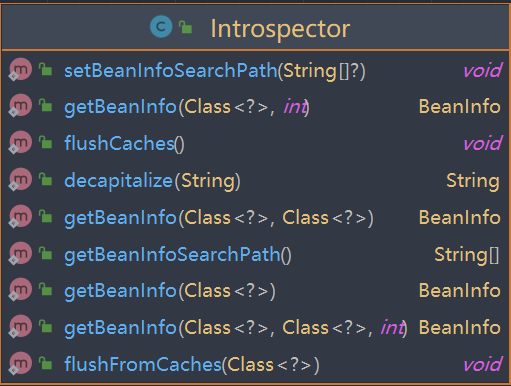
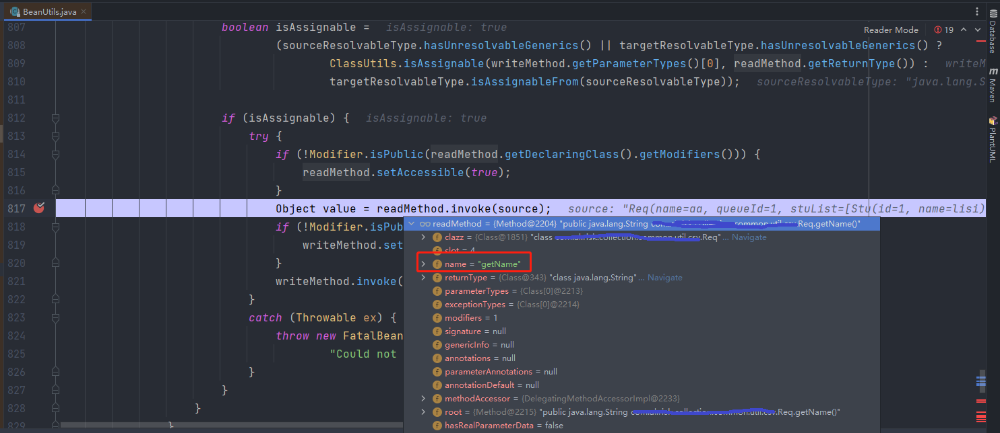

	内省，Introspector。Java通过位于java.beans包下的Introspector类来操作JavaBean。JavaBean这个名词经常听到，那么何为JavaBean？

其实JavaBean是一种使用规范，并不是一种技术。举个栗子，你现在想自己做一个单链表，用size字段来缓存链表的长度。伪代码如下：

```java
public final class JavaIntList {
  static class Node {
    public Node next;
    public int value;
  }
  public Node head;
  public int size;
}
```

ok接着你把这个打成jar包：intList.1.0.jar供他人使用，后来你决定不缓存了，改用实时计算：

```java
public final class JavaIntList {
  static final class Node {
    public Node next;
    public int value;
  }
  public Node head;
  public int getSize() {
	//计算逻辑
}
```

ok打包升级成intList.2.0.jar，用户纷纷跟着升级，后发现自己原来的程序报错了，说找不到 size 变量啥的。于是觉得这个jar不行，卸掉了。

所以我们在一开始写的时候，就要 **杜绝出现 public int size**这样的代码。而是让用户一开始就使用getSize()方法，以便有朝一日修改getSize

实现时，不破坏兼容性。这种public int getSize() { return size; }的惯用手法，就是Java Bean的规约之一了。 JavaBean的规约如下：

- 属性都是私有的；
- 有无参的public构造方法；
- 对私有属性根据需要提供公有的getXxx方法以及setXxx方法；
- 可序列化

详细描述可参考oracle提供的文档：https://download.oracle.com/otndocs/jcp/7224-javabeans-1.01-fr-spec-oth-JSpec/

回头说说内省机制（ Introspector）。 **一言以蔽之： Introspector 是操作 javaBean 的 API，用来访问某个属性的 getter/setter 方法。**

所以我们以后要获取某个类的某个属性，除了直接通过 getter/setter方法，还可以通过Introspector。

了解了Introspector类，接下来看看都有哪些API可以使用。



​	其中最常用的便是getBeanInfo()，可以获取传入class 的 bean相关信息。 `BeanInfo`是一个接口，具体实现是`GenericBeanInfo`，通过这个接口可以获取一个类的各种类型的描述符。主要方法： 

- `BeanDescriptor getBeanDescriptor()`：获取`JavaBean`描述符。
- `EventSetDescriptor[] getEventSetDescriptors()`：获取`JavaBean`的所有的`EventSetDescriptor`。
- **`PropertyDescriptor[] getPropertyDescriptors()`：获取`JavaBean`的所有的`PropertyDescriptor`。**
- `MethodDescriptor[] getMethodDescriptors()`：获取`JavaBean`的所有的`MethodDescriptor`。

其中 `PropertyDescriptor`这个类是通过存储器（`Setter`和`Getter`）导出一个属性，它应该是内省体系中最常见的类。主要方法： 

- `synchronized Class getPropertyType()`：获得属性的`Class`对象。
- `synchronized Method getReadMethod()`：获得用于读取属性值（`Getter`）的方法；
- `synchronized Method getWriteMethod()`：获得用于写入属性值（`Setter`）的方法。

看看例子：

```java
@Data
public class Stu {
	@FieldCompare(key = true)
	Long id;
	String name;
}

	@Test
	public void testIntrospector() throws IntrospectionException {
		BeanInfo beanInfo = Introspector.getBeanInfo(Stu.class);
		PropertyDescriptor[] propertyDescriptors = beanInfo.getPropertyDescriptors();
		Arrays.stream(propertyDescriptors).forEach(s->{
			System.out.println(s.getName());
		});
	}
```

控制台输入：

```java
class
id
name
```

 这里要注意一点，通过`BeanInfo#getPropertyDescriptors()`获取到的`PropertyDescriptor`数组中，除了`Bean`属性的之外，**还会带有一个属性名为`class`的`PropertyDescriptor`实例**，它的来源是`Class`的`getClass`方法，如果不需要这个属性那么最好判断后过滤，这一点需要紧记，否则容易出现问题。 

​		网上很多资料都说java的内省机制是通过反射来做的，但鲜有人解释说是怎么个反射法，究竟是通过获取Class的Field[]数组，再解除这个Field的安全检查（field.setAccessible(true)(当这个field对应的属性是私有时需要关闭安全性检查才能访问，直接访问会抛出IllegalAccessException)），然后通过Filed.get()方法来获取到这个字段的值？亦或是通过其他方法？这里举一个我们实际开发中经常用到的例子来说明大家就清楚了。

​		实际开发中，我们经常会将数据库实体里的部分数据取出来，然后通过Vo返回出去。这个大家都会想到用`BeanUtils.copyProperties(Object source, Object target, @Nullable Class<?> editable,@Nullable String... ignoreProperties);` 来做（下称`BeanUtils.copyProperties(source ,target)`）。其实这个方法就应用到了java内省。看看核心源码：

```java
private static void copyProperties(Object source, Object target, @Nullable Class<?> editable,
      @Nullable String... ignoreProperties) throws BeansException {

    Assert.notNull(source, "Source must not be null");
    Assert.notNull(target, "Target must not be null");

    Class<?> actualEditable = target.getClass();
    if (editable != null) {
      if (!editable.isInstance(target)) {
        throw new IllegalArgumentException("Target class [" + target.getClass().getName() +
            "] not assignable to Editable class [" + editable.getName() + "]");
      }
      actualEditable = editable;
    }
    
    //获取target的属性集
    PropertyDescriptor[] targetPds = getPropertyDescriptors(actualEditable);
    List<String> ignoreList = (ignoreProperties != null ? Arrays.asList(ignoreProperties) : null);

    for (PropertyDescriptor targetPd : targetPds) {
      //获取target属性上的Setter()方法
      Method writeMethod = targetPd.getWriteMethod();
      if (writeMethod != null && (ignoreList == null || !ignoreList.contains(targetPd.getName()))) {
          //在source上获取跟target中的与此属性名字相同的PropertyDescriptor
        PropertyDescriptor sourcePd = getPropertyDescriptor(source.getClass(), targetPd.getName());
        if (sourcePd != null) {
            //相当于拿到这个source的getter()方法，因为要读source的值，将其赋值给target
          Method readMethod = sourcePd.getReadMethod();
          if (readMethod != null) {
            ResolvableType sourceResolvableType = ResolvableType.forMethodReturnType(readMethod);
            ResolvableType targetResolvableType = ResolvableType.forMethodParameter(writeMethod, 0);

            // Ignore generic types in assignable check if either ResolvableType has unresolvable generics.
            boolean isAssignable =
                (sourceResolvableType.hasUnresolvableGenerics() || targetResolvableType.hasUnresolvableGenerics() ?
                    ClassUtils.isAssignable(writeMethod.getParameterTypes()[0], readMethod.getReturnType()) :
                    targetResolvableType.isAssignableFrom(sourceResolvableType));

            if (isAssignable) {
              try {
                if (!Modifier.isPublic(readMethod.getDeclaringClass().getModifiers())) {
                  readMethod.setAccessible(true);
                }
                  //拿到source上的值
                Object value = readMethod.invoke(source);
                if (!Modifier.isPublic(writeMethod.getDeclaringClass().getModifiers())) {
                  writeMethod.setAccessible(true);
                }
                 //将source上的值赋给target
                writeMethod.invoke(target, value);
              }
              catch (Throwable ex) {
                throw new FatalBeanException(
                    "Could not copy property '" + targetPd.getName() + "' from source to target", ex);
              }
            }
          }
        }
      }
    }
  }
```

我们看到 `BeanUtils.copyProperties(Object source, Object target, @Nullable Class<?> editable,@Nullable String... ignoreProperties)` 并不是简单粗暴地通过获取Class的Field来获取属性的值，而是通过

`Object value = readMethod.invoke(source);`这个方法来获取的，而这个方法正是Class的getXXX()方法，

如何证明？

见下图，我的实体类是

```java
@Data
//这里为了简单，没有手写getter()，setter()等胶水代码，直接使用@Data注解，效果等同getter(),setter()方法
public class Req {
	String name;
	Long queueId;
	List<Stu> stuList;

}

```

而拿到的method的name如下图所示：



可以看到，`BeanUtils.copyProperties(source ,target)`中通过内省来获取属性的值是通过getter()方法来做到的，而javaBean中getter()方法是public的，**所以通过这种方式来获取Bean属性值不会破坏类的安全性**，，这是java内省和反射获取JavaBean属性值的最大区别。

